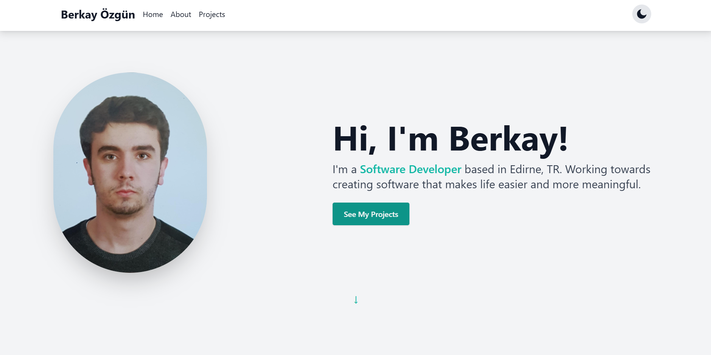

# Berkay Özgün Portfolio

This project is a modern portfolio web application designed to showcase Berkay Özgün's software development experience, projects, and skills.

## Features
- Multi-language support (Turkish & English)
- Modern and responsive design
- **Project carousel/slider**: View multiple projects at once, with smooth auto-slide and manual navigation
- **Auto-play & pause on hover**: Projects slide automatically, pausing when hovered
- **Manual navigation**: Use arrows or dots to navigate projects
- **Responsive carousel**: 1, 2, or 3 projects visible depending on screen size
- Project gallery and detail modals
- Contact form
- Dark/light theme support
- Animations and user-friendly interface
- Performance optimized for production

## Screenshots



## Getting Started

1. Clone the repository:
   ```bash
   git clone https://github.com/berkayozgun/portfolio.git
   cd berkayozgun-portfolio
   ```
2. Install dependencies:
   ```bash
   npm install
   ```
3. Start the development server:
   ```bash
   npm run dev
   ```
4. Open your browser at: `http://localhost:5173`

## Build & Deploy

- To build for production:
  ```bash
  npm run build
  ```
- The build output will be in the `dist/` folder. You can deploy it to any static server.

## Technologies Used
- React
- TypeScript
- Vite
- TailwindCSS
- Framer Motion
- i18next

## Demo

> [Live Demo Link](https://berkayozgun.vercel.app) <!-- Update with your actual deployed link -->

## Contribution & License

This is a personal portfolio project. For suggestions or contributions, feel free to contact me.

---

Berkay Özgün © 2024
